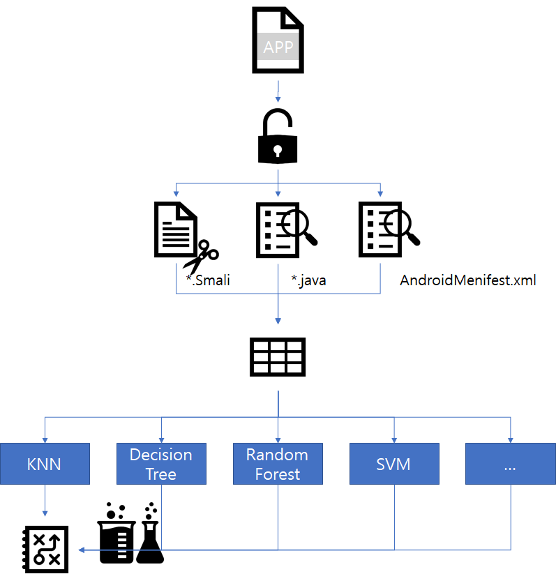

cisc 2017 Android Malware Detection 
==============

This project is android malware app detection report for cisc2017 : http://challenge.cisc.or.kr/%EB%AA%A8%EB%B0%94%EC%9D%BC-%EC%95%85%EC%84%B1%EC%95%B1-%ED%83%90%EC%A7%80/


Introduction
--------------------
This script decompiles an apk to its corresponding java sources, smali sources, Androidmenifest.xml. 
1nd directory code extract and preprocess some features of apk files. Sample apk 2000 files are provided by the cisc2017 organizer.
After that, we can test with machine-learning algorithm .

And 2nd directory is the codes to detect malware codes and classificate malware family. the cisc2017 organizer give us 2,000 apk file more with no answer.   
Predicting this and submitting it calculate the score and confirm the entry into the finals.

Usage
--------------------
```
jupyter notebook
```


Tools used
--------------------
JRE >1.7 (Java Runtime Environment)

apktool : https://github.com/iBotPeaches/Apktool

jadx : https://github.com/skylot/jadx
  
Python >3

scikit-learn, pandas, keras 

Program Process
--------------------
